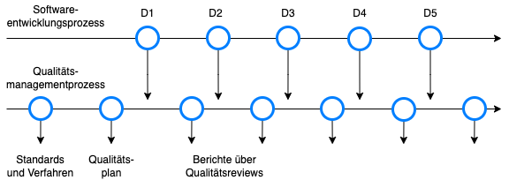

## Agiles Software Projektmanagement

#### Wintersemester 2023/2024

1. [Einführung](?url=01.kapitel.md)
1. [Projektmanagement - Was versteht man darunter?](?url=02.kapitel.md)
1. [Welche Ansätze gibt es?](?url=03.kapitel.md)
1. [Das agile Wertesystem und Mindset](?url=04.kapitel.md)

...

---
class: center, middle

# Beispiel für Markdown

---
class: center, middle

# Themenüberschrift

Max Mustermann [Matrikelnummer]

---
# Inhalt
***

1. Einführung

1. Standards

1. Softwaremessung

1. Zusammenfassung

1. Quellen

---

# Einführung

Softwaresysteme sollen "**_fit for purpose_**" sein.

- **Effizient**
- *Zuverlässig*
- Fertigstellung innerhalb eines Zeit- und Kostenrahmens

Die Techniken des Softwarequalitätsmanagements kommen ursprünglich aus der Fertigungsindustrie.

**Qualitätssicherung** ist die Definition von Prozessen und Standards, die zu qualitativ hochwertigen Produkten führen, und die Einführung dieser Qualitätsprozesse in den Fertigungsprozess.

**Qualitätslenkung** ist die Anwendung dieser Qualitätsprozesse, um Produkte auszusieben, die dem geforderten Qualitätsniveau nicht entsprechen.

---

# Einführung

Um die Prozesse in der Softwareentwicklung umzusetzen, stellen die Teams sicher, dass die zuvor festgelegten Standards und Ziele des Unternehmens mit dem Produkt übereinstimmen.




---

# Standards

Softwarestandards spielen eine wichtige Rolle im Qualitätsmanagement.

1. Standards kapseln Erfahrungen, die für das Unternehmen von großem Wert sind.

2. Standards bieten einen Rahmen für die Definition, was "Qualität" innerhalb des Softwareentwicklungsprojektes bedeutet.

3. Standards tragen zur Kontinuität bei, sodass alle Entwickler nach denselben Verfahren arbeiten.

---

# Standards

Standards müssen sich immer positiv auf die Produktqualität auswirken.

**Produktstandards** sollten dabei so entworfen werden, dass sie kosteneffizient angewendet und geprüft werden können.

**Prozessstandards** sollten die Prozesse definieren, die prüfen, dass die Produktstandards eingehalten werden.  

| Rolle | Aufgabe |
|:------:|:----------:|
| **Auftraggeber** | Erteilt den Auftrag und bezahlt das Projekt |
| **Auftragnehmer** | Nimmt die Anforderungen an das Softwareprodukt entgegen|
| **Benutzer** | Benutzen die Software. Manchmal mit Auftraggeber identisch |
| **Manager** | Treffen während des Projekts organisatorische Entscheidungen |
| **Berater** | Unterstützen den Kunden in der Definition der Anforderungen |
| **Informatiker** | Definieren und entwickeln Software in verschiedenen Rollen mit unterschiedlichen Aufgaben aufgeteilt|

---

# Softwareentwicklung

Entwicklungsmethoden:

- _Prüfen von Code, bevor er eingefügt wird:_  
  Entwickler prüfen den Code ihrer Teammitglieder, bevor der Code in die aktuelle Version eingebracht wird.

- _Probleme beheben, sobald sie auftreten:_  
  Probleme sollten sofort behoben werden, wenn sie entdeckt werden, auch wenn der Code von anderen Entwicklern stammt.

---

# Softwaremessung

Bei der Softwaremessung geht es darum, Merkmale eines Softwaresystems zu quantifizieren.

Code block:

```javascript
function add(a, b)
  return a + b
end
```

---
# Markdown

## Paragraph

Paragraph mit **strong**, *italic*, `code`.

Links so [github](https://github.com/) oder so https://github.com/ .

## Tabelle

|ID|Name|Value|
|--|----|-----|
| 1|foo |   10|
| 2|bar |   20|


---
# Aufzählung

1. Nummer 1
    - bullet 1
    - bullet 2
2. Nummer 2
    1. child 1
    2. child 2
3. Nummer 3

---

# Zusammenfassung

- Folien werden mit `---` voneinander abgetrennt (Achtung: kein Leerzeichen am Ende)
- Bilder, Diagramme etc. im `media`-Unterverzeichnis speichern
- Wird die Datei `remark-latest.min.js` heruntergeladen, können die Folien offline bearbeitet werden. Pfad im `script`-Tag anpassen.
- [Remark.js](https://remarkjs.com/)

---

class: center, middle

# Fragen?

---
# Quellen
***

- Kitchenham, B. (1990). Software Development Cost Models. 487-517.

- Chidamber, S., and C. Kemerer. (1994). A Metrics Suite for Object-Oriented Design. 476-493.
